# zjgsu抢课脚本 
## 使用教程（ 2023 - 2024 - 1 ）

## 观前提醒：

此项目仅用于python学习交流，请勿用于非法用途[doge]。

使用过程略有些复杂，请耐心按照以下教程逐步操作。

## 背景

一个倒霉的开发者在某次第一轮选课时候一门课没摇上，本着我命由我不由天的精神，怒写抢课脚本，然后就有了本仓库。

脚本效果拔群，想要的好课都抢到了:P

## 简介

- 脚本会模拟你点击选课的操作
- 直到接收到抢课成功后停止运行。
- 这个脚本理论上可以适配大多数比较简单的抢课系统

- 因为需要开始后才能配置 所以本脚本适用于捡漏他人退课的情景 而不适合秒杀场景

## 文件构成：

使用此脚本，必要的文件有两项：
- `JSONs` 文件夹以及其中的`.json`文件（你需要手动配置的抢课信息）
- `PostJson_tk_1.2.exe`（信息配置完成后执行抢课程序的脚本）[下载地址](https://github.com/RwandanMtGorilla/ZJGSU_spider/releases/tag/exe)

使用前请检查两项项文件是否完整。

## 如何使用：

### 1. 课程信息写入（在选课期间操作）

- 确认并记录（Ctrl+c）你要抢的课程名称，确保无课程时间冲突（如果有 将以最先
抢到的为准）

- 登录并进入[选课界面](http://124.160.64.163/jwglxt/)（网址）
页面任意位置右键单击并下拉找到 *检查* 并点击（或按F 12 ）

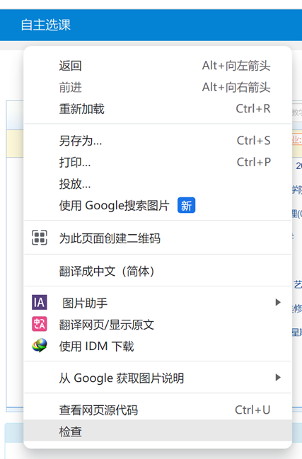

- 在右侧弹出的开发者模式界面中找到 *network*（或*网络*）并点击

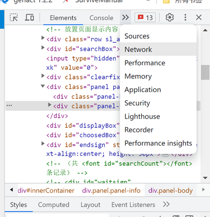
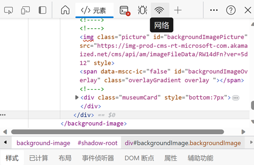

- 点击Fetch/XHR

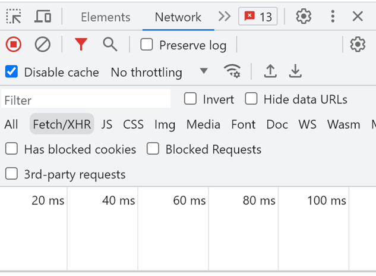

- 在左侧选课界面找到 你想要的课 进行 *选课* （可以是满课的课程 只需要点击一次 用以获取自己的账号信息）

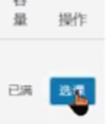

- 完成上一步操作后，右侧将会出现数据包

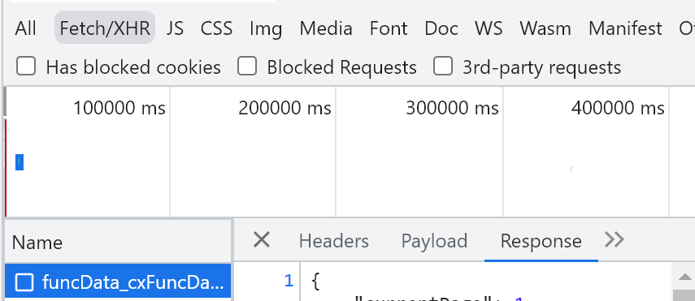

- 右键单击 > Copy > Copy as cURL(bash)

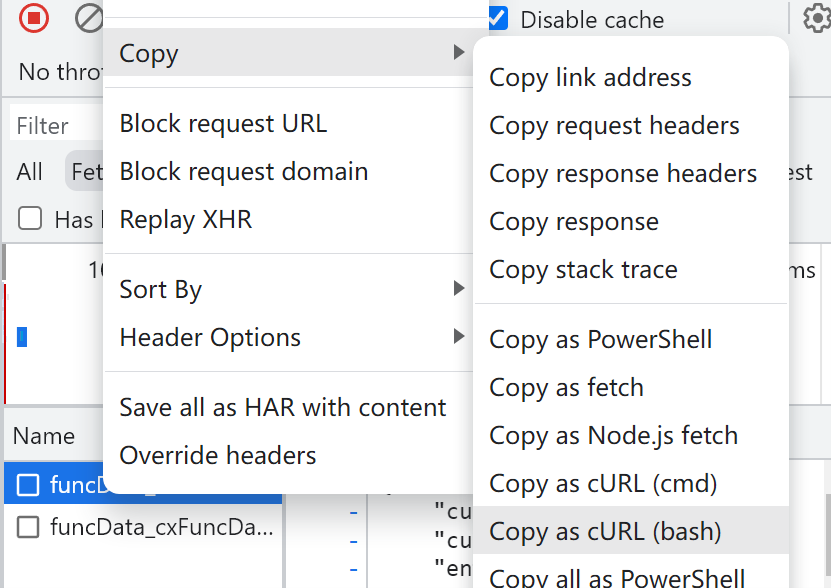

- 进入[curlconverter网站](https://curlconverter.com/) （转换curl请求为JSON）
- 将之前复制的curl内容复制入curl command，language选择JSON

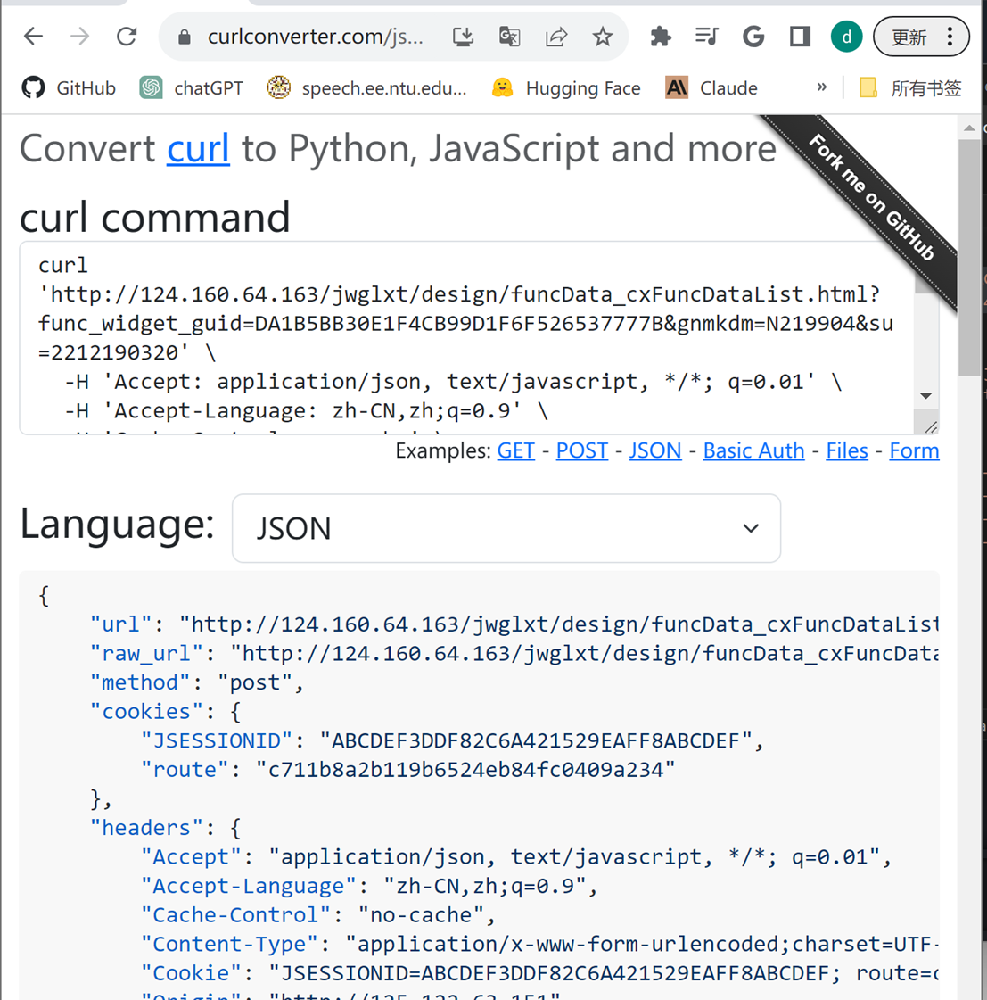

*（例图中信息已经过混淆处理）*

- 在`JSONs`文件夹中新建一个`.json`文件 将刚刚的信息复制进去并保存 (用一个你记得住的名字)(可以新建txt然后改后缀)

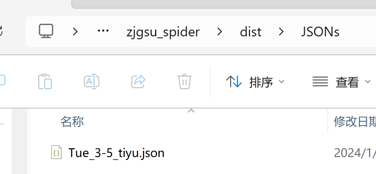

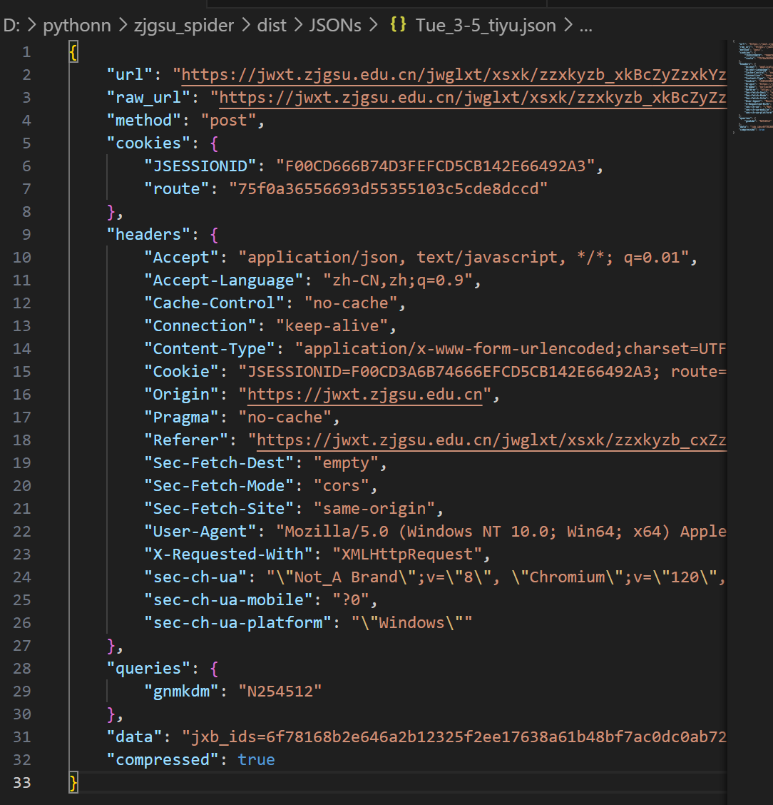

### 2. 脚本，启动！（请在config.test.json填写完整后进行）

- 双击 `PostJson_tk_1.2.exe` 
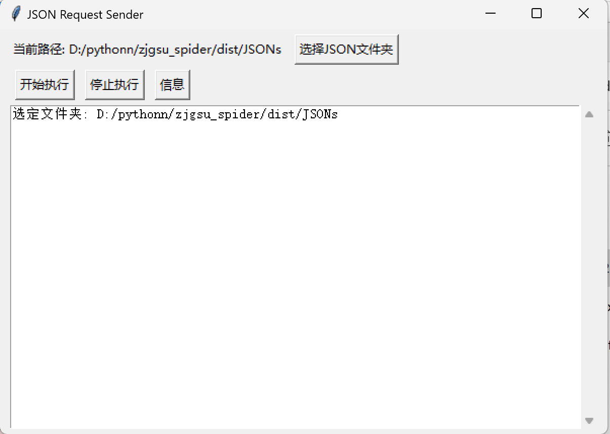

- 选择你存放 `.json` 文件的文件夹
- 点击开始执行 如果不断弹出运行信息 即说明运行成功

## 完整代码
完整代码请查看 [`PostJson_multi.py`](PostJson_multi.py)